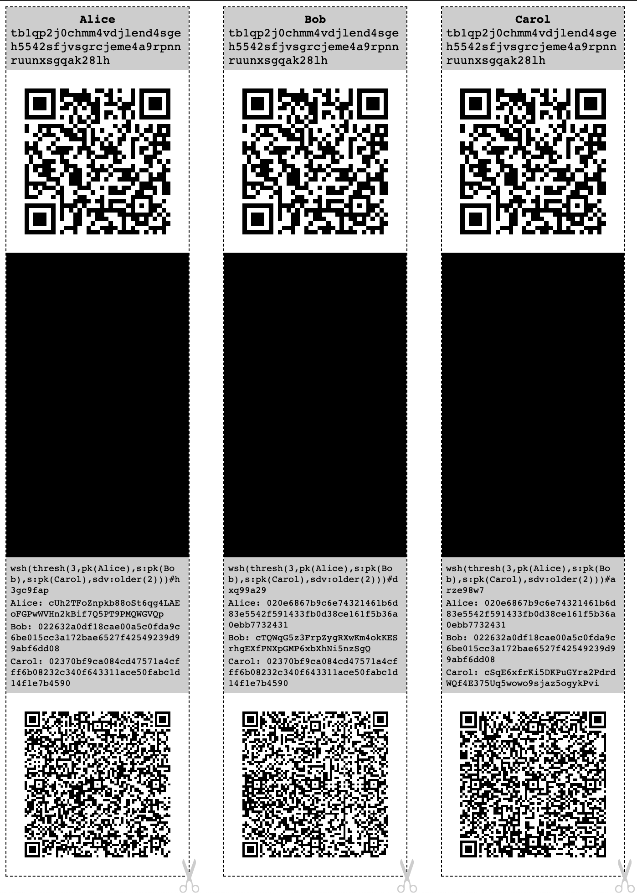

# Rusty-paper-wallet

Generates bitcoin paper wallet offline in a single html page with p2wpkh address.



## Usage

Cut the dotted line, fold the private key over the black area, then fold a second time, plastify the paper.

## Running the software

Requires [rust](https://www.rust-lang.org/)

```
$ cargo install rusty-paper-wallet
$ rusty-paper-wallet
data:text/html;base64,PCFET0NUWVBFIGh0bWw+PGh0bWwgbGFuZz0iZW4iPjxoZWFkPjxtZXRhIGNoYXJzZXQ9IlVURi04Ij48dGl0bGU+Qml0Y29pbiBQYXBlciBXYWxsZXQ8L3RpdGxlPjxzdHlsZT4gYm9keSB7IHdpZHRoOiAyODBweDsgYWxpZ24taXRlbXM6IGNlbnRlcjsgYm9yZGVyOiBkYXNoZWQ7IGJvcmRlci13aWR0aDogdGhpbjsgfSBkaXYuYnJlYWstd29yZCB7IHdvcmQtYnJlYWs6IGJyZWFrLWFsbDsgYmFja2dyb3VuZC1jb2xvcjogbGlnaHRncmF5OyBwYWRkaW5nOiA1cHg7IC13ZWJraXQtcHJpbnQtY29sb3ItYWRqdXN0OiBleGFjdDsgfSBkaXYuY2VudGVyIHsgdGV4dC1hbGlnbjogY2VudGVyOyBoZWlnaHQ6IDI4MHB4OyB9IGRpdi5ibGFjayB7IGhlaWdodDoyODBweDsgYmFja2dyb3VuZC1jb2xvcjogYmxhY2s7IC13ZWJraXQtcHJpbnQtY29sb3ItYWRqdXN0OiBleGFjdDsgfSBpbWcucXIgeyBoZWlnaHQ6IDIxMHB4OyBtYXJnaW46IDM1cHg7IGltYWdlLXJlbmRlcmluZzogcGl4ZWxhdGVkOyB9IDwvc3R5bGU+PC9oZWFkPjxib2R5PjxkaXYgY2xhc3M9ImJvdGgiPjxkaXYgY2xhc3M9ImJyZWFrLXdvcmQiPmJjMXE5bDV5eXZuY2pldmU4Z3Zsejg1eHo2eW54cjVzbWZnN2UyamN0OTwvZGl2PjxkaXYgY2xhc3M9ImNlbnRlciI+PGltZyBjbGFzcz0icXIiIHNyYz0iZGF0YTppbWFnZS9ibXA7YmFzZTY0LFFrMnlBQUFBQUFBQUFENEFBQUFvQUFBQUhRQUFBQjBBQUFBQkFBRUFBQUFBQUhRQUFBQUFBZ0FBQUFJQUFBSUFBQUFDQUFBQS8vLy9BQUFBQUFEK2t0d1FnbGhJRUxvZzZNaTZ0S0t3dWpKUHdJTGRpTGorVnNxd0FOcVltS2I4RCtndFVQd1Fta0FtT0hTVTR4aWU4VlJBK0IvSWlHcWNCMGh0U0h3Z3E5eitTTEgybG1DT2duc3dZWWl1U0piZW5RQUFlRkFBL3FxcitJS2JtZ2k2QlVyb3VsbXE2TG9qUXVpQ1cySUkvbE1iK0E9PSIvPjwvZGl2PjwvZGl2PjxkaXYgY2xhc3M9ImJsYWNrIj48L2Rpdj48ZGl2IGNsYXNzPSJibGFjayI+PC9kaXY+PGRpdiBjbGFzcz0iYm90aCI+PGRpdiBjbGFzcz0iYnJlYWstd29yZCI+S3lKTG5wb25tRURYbzNtalJIRW01ZE52aWpQOGJuRjZ5WFFkZ1FWaG1hSnIycXZTanlyYjwvZGl2PjxkaXYgY2xhc3M9ImNlbnRlciI+PGltZyBjbGFzcz0icXIiIHNyYz0iZGF0YTppbWFnZS9ibXA7YmFzZTY0LFFrMUdBUUFBQUFBQUFENEFBQUFvQUFBQUlRQUFBQ0VBQUFBQkFBRUFBQUFBQUFnQkFBQUFBZ0FBQUFJQUFBSUFBQUFDQUFBQS8vLy9BQUFBQUFEK24wdTRnQUFBQUlKQWQvQUFBQUFBdWhyQ0RBQUFBQUM2RU1HK0FBQUFBTHFSSnZpQUFBQUFnaERraUlBQUFBRCtwOE9zQUFBQUFBQzhzb3dBQUFBQXlucksrSUFBQUFBWjA4ZElBQUFBQUM1REsrRUFBQUFBOE5JbVU0QUFBQUFtVUpLeWdBQUFBRldSajVpQUFBQUFjNWVwUHdBQUFBRFU1VUJRQUFBQUFPK0gzeThBQUFBQUVXWlVPWUFBQUFDamJxVnRBQUFBQVBnTXgxQUFBQUFBamxjdk13QUFBQUJ4OCswaEFBQUFBUFloejBFQUFBQUFCYWVwVUlBQUFBQ0w1QmI4Z0FBQUFBQ2gxQUFBQUFBQS9xcXF2NEFBQUFDQ3FKeWdnQUFBQUxyS082NkFBQUFBdXBOZ3JvQUFBQUM2VEk2dWdBQUFBSUlnVkNDQUFBQUEvcnZqdjRBQUFBQT0iLz48L2Rpdj48L2Rpdj48L2JvZHk+PC9odG1sPg==
```

Copy and paste all the output in the address bar of a browser. By using a data url no data is written to the disk, improving privacy.

## Supports different kind of addresses:

* legacy pay to public key hash with `ADDRESS_TYPE=p2pkh cargo run`
* nested segwit pay to script hash with `ADDRESS_TYPE=p2shwpkh cargo run`
* standard p2wpkh with `cargo run`
